# Agent Rebuild

**中文** | [English](#english) | [快速进入：从 0 学做一个智能体](#从-0-学做一个智能体)

> 一个受 OpenClaw 与 Claude Code 启发的 TypeScript Agent Runtime，围绕长期记忆、工具执行、Gateway 编排、MCP 集成与可审计开发工作流构建。

<p align="center">
  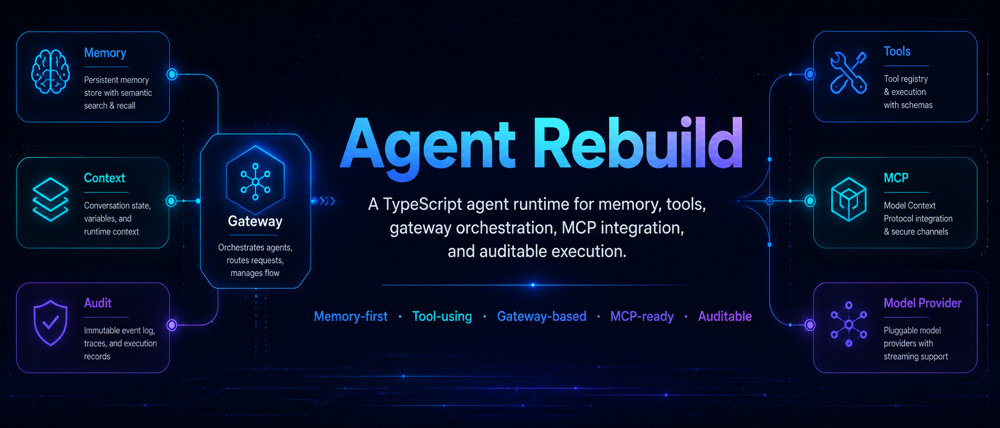
</p>

<p align="center">
  <b>Memory-first | Tool-using | Gateway-based | MCP-ready | Auditable</b>
</p>

<p align="center">
  <a href="package.json"></a>
  <a href="#快速开始"></a>
  <a href="docs/ws-protocol.md"></a>
  <a href="package.json"></a>
</p>

Agent Rebuild 是一个面向本地开发任务的实验性 TypeScript Agent Runtime。它不是简单的聊天机器人外壳，而是把长期记忆、上下文管理、模型调用、工具执行、权限控制、WebSocket 接入、MCP 工具生态和审计日志放到统一 Gateway 中进行编排。

项目受到 OpenClaw 和 Claude Code 启发，但目标不是简单复制，而是探索如何用 TypeScript 重建一个可运行、可观察、可扩展、可恢复的 Agent 基础设施。

## 什么是 Agent Rebuild？

`agent-rebuild` 是一个 Windows-first 的本地 AI Agent Gateway。用户请求可以来自 REPL、WebSocket Client、React Web UI 或未来的其他入口；Gateway Runtime 会把请求绑定到会话，构建上下文，调用模型，执行受控工具，记录 transcript 与 audit log，并把运行事件推送给前端或客户端。

它主要面向以下场景：

- 本地开发任务与代码仓库维护。
- 可审计的模型工具调用链路。
- 长会话、长期记忆和上下文压缩实验。
- MCP、WebSocket、Web UI 与本地工具生态的统一接入。
- 多 Agent 工作流、自动化验证和 Agent 工程研究。

## 为什么做这个项目？

普通 Agent 系统一旦开始读写文件、运行命令、调用外部工具和记住历史信息，就会暴露出一批工程问题。Agent Rebuild 主要围绕这些问题建立运行时边界。

| 问题 | Agent Rebuild 的方向 |
| --- | --- |
| 长期记忆弱，历史信息难以稳定召回。 | Markdown-first memory、daily notes、chunking、SQLite FTS、vector search 与 hybrid retrieval。 |
| 工具调用过程不透明，失败后难以追踪。 | Tool registry、schema 校验、权限检查、结构化结果、审计日志与 WebSocket 事件。 |
| 上下文容易膨胀，长会话成本高。 | Layered context、token budget、transcript compaction、大结果截断与持久化。 |
| CLI、Web UI、WebSocket、MCP 入口分散。 | Gateway Runtime 统一请求路由、会话、模型、工具和事件。 |
| 执行结果需要可审计、可恢复、可复现。 | JSONL audit logs、transcript persistence、session metadata、idempotency key 与 replay-oriented events。 |

## 项目规模

<p align="center">
  
</p>

| 指标 | 数量 | 说明 |
| --- | ---: | --- |
| 总行数 | **55,208** | 仓库内代码与文档统计，不含 `node_modules` / 构建产物。 |
| 代码行数 | **53,582** | TypeScript / TSX / JavaScript。 |
| 代码文件 | **203** | 覆盖 Gateway、Web UI、WS Client、Memory、Model、Storage、脚本和测试。 |
| Gateway 核心文件 | **99** | `packages/gateway` 下的运行时、工具、安全、WS、ReviewGraph 等模块。 |
| 测试规模 | **410 passing tests** | 原 README 统计中 `npm run gateway:check` 的测试规模。 |
| 包结构 | **8 packages + 2 apps** | 多包架构，包含本地 Gateway 和 React 控制台。 |

## 核心能力

| 领域 | 能力 |
| --- | --- |
| Memory Core | Markdown memory、daily notes、SQLite FTS、vector search、hybrid retrieval、recency-aware ranking。 |
| Gateway Runtime | REPL 与 WebSocket 入口、请求路由、会话管理、runtime status、取消任务、streaming-ready events。 |
| Tool System | Tool registry、schema validation、结构化工具调用、文件 / Shell / Build / Test / Git / Web / Todo / Memory / Audit 工具。 |
| MCP Integration | MCP manager、client、config loader 与 adapter layer，用于动态注册外部 MCP tools。 |
| Context Builder | Layered prompt assembly、memory retrieval、repository context、transcript compaction、token budget。 |
| Audit & Safety | Permission policy、path guard、shell risk checks、approval tokens、tool logs、structured execution records。 |
| Model Provider | OpenAI-compatible provider abstraction、MiniMax TokenPlan adapter、mock provider、streaming delta support。 |
| Session Store | Transcript persistence、session recovery metadata、usage records、JSONL audit logs。 |
| WebSocket API | v1.0 request / event protocol，覆盖 chat、session、memory、tool、approval、audit、MCP 与 skills。 |
| Web UI | React / Vite 本地控制台，展示 sessions、runs、tool timeline、approval、memory、audit 和 status。 |
| ReviewGraph | **Experimental**：Explore、Plan、Implement、Test、Verify、Security、Reviewer 多 Agent 工作流。 |

## 视觉总览

### 动态运行图

<p align="center">
  
</p>

这张动态图展示了“用户输入 -> Gateway -> 上下文 -> 模型 -> 工具执行 -> 审计 / 事件 -> Web UI”的主路径。移动光点代表一次请求中的模型调用、工具证据回填和实时事件广播。

### 运行链路

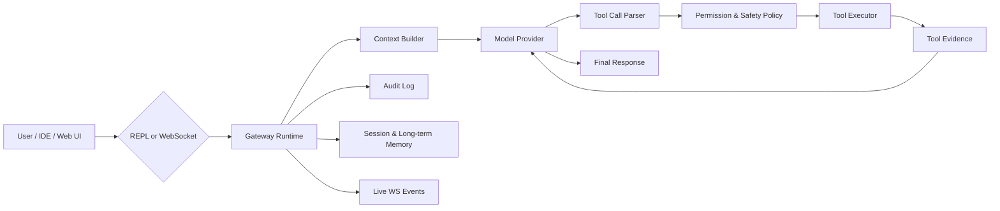

### 本地控制台布局

```text
+----------------------+--------------------------------------+----------------------+
| Sessions / Navigation | Chat, runs, streaming output          | Timeline / Events    |
|                      |                                      |                      |
| - Recent sessions    | - User and assistant messages         | - run.started        |
| - Project binding    | - Tool calls and outputs              | - chat.delta         |
| - Memory / audit     | - DevTask and ReviewGraph progress    | - tool.finished      |
| - Approvals          | - Runtime status summary              | - approval.required  |
+----------------------+--------------------------------------+----------------------+
```

### 多 Agent ReviewGraph

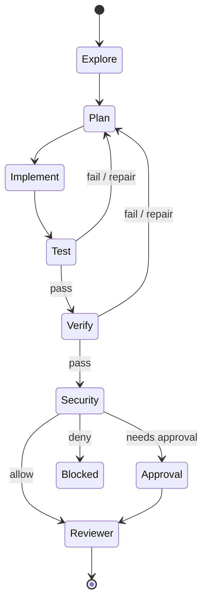

### 上下文与检索

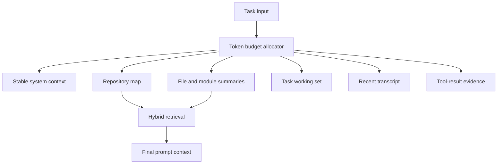

## System Architecture

Gateway Runtime 是系统中枢。用户请求进入 Gateway 后，会被归一化、绑定到 session、进入 Context Builder，并在模型和工具之间形成可审计的执行循环。

中间核心层由 Context Builder、Memory Core、Tool System 和 MCP Manager 组成；底层通过 SQLite、Markdown、JSONL、Tool Results 和 session store 保留可恢复状态。

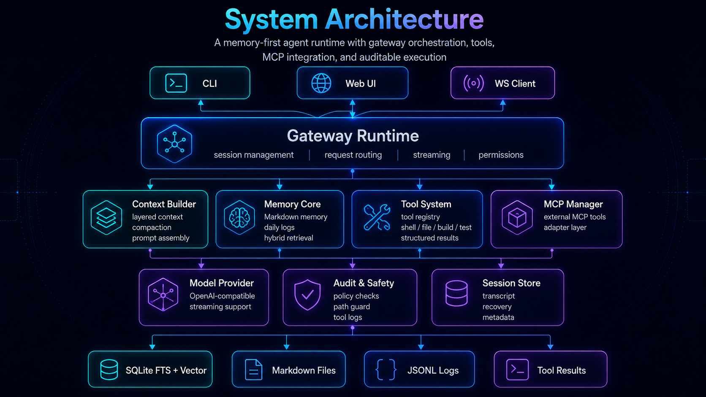

结构要点：

- 用户请求可以来自 REPL、Web UI、WebSocket Client 或未来的 IDE / SDK 接入。
- Gateway Runtime 统一处理请求路由、会话状态、权限策略、模型调用和事件输出。
- Context Builder、Memory Core、Tool System、MCP Manager 是 Agent 能力的核心层。
- Model Provider、Audit & Safety、Session Store 提供模型接入、安全审计和状态持久化。
- SQLite、Markdown、JSONL 和 Tool Results 构成底层存储与执行证据。

## Memory Pipeline

Agent Rebuild 使用 Markdown-first 的长期记忆流程：

```text
Markdown Sources -> Chunking -> Embeddings -> Hybrid Index -> Memory Search -> Context Builder
```

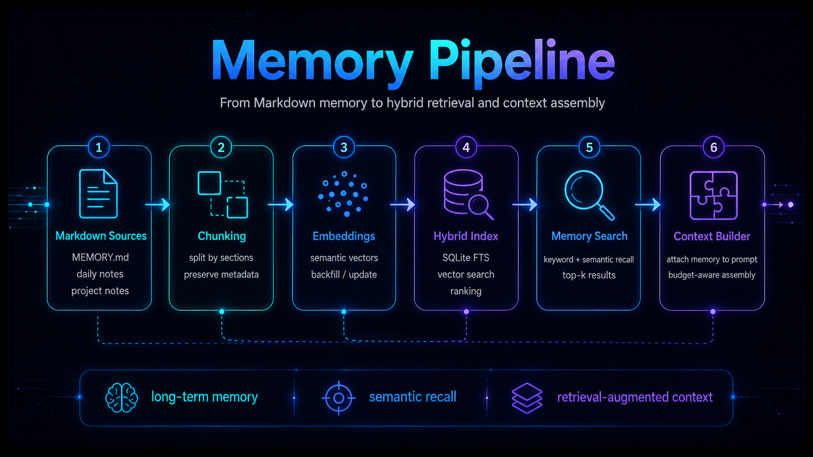

`workspace/MEMORY.md` 和 `workspace/memory/*.md` daily notes 是长期记忆来源。文档会被切分为 chunks，并保留 file path、section、date 等 metadata。Embeddings 可通过 DashScope 生成，也可以使用 `EMBEDDING_PROVIDER=mock` 进行离线验证。

检索时，SQLite FTS / LIKE fallback 提供精确文本证据，vector search 提供语义邻居，两路结果通过 hybrid ranking 与 recency boost 融合后进入 Context Builder，用于 prompt assembly。

## Tool Execution Loop

工具执行循环的目标是让 Agent action 更安全、更可追踪、更容易恢复。

```text
User Request -> Plan / Decide -> Permission Check -> Tool Call -> Result Capture -> Verify / Retry -> Final Response
```

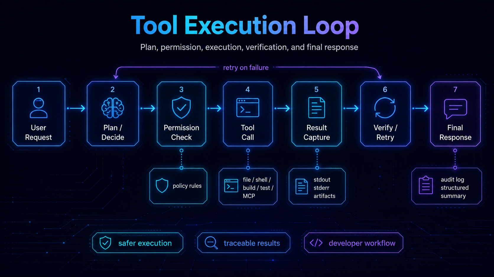

工具调用前会经过 schema validation、permission policy、path guard 和 shell risk checks。执行结果会以结构化方式捕获 stdout、stderr、artifacts、错误信息和审计记录。大输出会被截断或持久化，避免直接撑爆上下文。

如果工具调用失败，Agent loop 可以基于真实错误进入 verify / retry，或者把失败证据明确反馈给用户。最终响应应基于真实 tool result，而不是空口声称完成。

## 快速开始

### 环境要求

- Windows 10/11 是主要目标环境。
- Node.js >= 18。
- MiniMax TokenPlan API Key 用于真实模型调用。
- DashScope API Key 可选，用于 live embeddings。
- Tavily API Key 可选，用于 web search。

### 安装

```bash
git clone https://github.com/yfrcg/agent-rebuild.git
cd agent-rebuild
npm install
copy .env.example .env
```

编辑 `.env`，至少设置：

```env
GATEWAY_MODEL=tokenplan
TOKENPLAN_API_KEY=your_api_key
WINDOWS_PROJECT_ROOT=D:\WorkStation\agent-rebuild
WORKSPACE_ROOT=D:\WorkStation\agent-rebuild\workspace
GATEWAY_SANDBOX_ALLOWED_ROOTS=D:\WorkStation\agent-rebuild;D:\WorkStation\agent-rebuild\workspace
```

如果只想离线验证流程，可以使用：

```env
GATEWAY_MODEL=mock
EMBEDDING_PROVIDER=mock
```

### REPL 模式

```bash
npm run gateway
```

### WebSocket Gateway + Web UI

建议开两个终端：

```bash
npm run gateway:ws
npm run web:dev
```

Web UI 默认通过 `VITE_GATEWAY_WS_URL` 连接 Gateway。未配置时使用 `/v1/ws`；本地开发可配置为：

```env
VITE_GATEWAY_WS_URL=ws://127.0.0.1:8787/v1/ws
```

## 常用脚本

| 命令 | 用途 |
| --- | --- |
| `npm run gateway` | 启动本地 REPL Gateway。 |
| `npm run gateway:ws` | 启动 WebSocket Gateway。 |
| `npm run web:dev` | 通过 Vite 启动 React Web UI。 |
| `npm run web:build` | 类型检查并构建 Web UI。 |
| `npm run typecheck` | 执行 TypeScript no-emit 类型检查。 |
| `npm test` | 通过 `scripts/run-tests.ts` 运行测试套件。 |
| `npm run reindex` | 重建 memory indexes。 |
| `npm run backfill:embeddings` | 回填 memory embeddings。 |
| `npm run gateway:smoke:all` | 运行 Gateway smoke checks。 |
| `npm run gateway:detect` | 运行离线系统检测。 |
| `npm run gateway:check` | 运行 typecheck、build、tests、smoke checks 与 offline detection。 |
| `npm run gateway:check:live` | 完整本地检查后追加 live system detection。 |

## 工具系统

内置工具通过 `packages/gateway/builtinTools.ts` 注册，并统一进入 `ToolCallExecutor`。

| 分组 | 工具示例 |
| --- | --- |
| File | `file.read`, `file.write`, `file.edit`, `file.list`, `file.glob`, `file.grep`, `file.multi_edit`, `file.patch` |
| Shell | `shell.run`, `bash.run`, `npm_test`, `build`, `run_test` |
| Development | `typecheck.run`, `lint.run`, `verify.run` |
| Git | `git.status`, `git.diff`, `git.commit` |
| Repository | `repo.map`, `repo.symbols`, `repo.deps` |
| Web | `web.fetch`, `web.search` |
| Todo | `todo.write`, `todo.update`, `todo.list` |
| Agent / Audit | `agent.verify`, `policy.check`, `audit.query` |
| Memory | `memory.search`, `memory.write` |
| Skills / MCP | `skill`，以及动态注册的 `mcp.*` tools |

所有工具调用都会经过 schema 校验、工作区路径策略、命令风险检查、审批策略、输出截断和审计记录。

## 从 0 学做一个智能体

这一节面向第一次学习 Agent 工程的读者。目标不是一次读完所有源码，而是按“能跑起来 -> 能理解一次请求 -> 能加一个工具 -> 能做记忆和 UI -> 能做多 Agent”的顺序，把这个项目当成一本可运行的教学指导书。

源码里保留了 `Learning note` 注释。阅读时可以在编辑器里搜索 `Learning note`，它们是主链路上的教学路标：每个注释都标在一个应该停下来理解的函数附近。

### 源码注释风格

本项目采用接近 Stanford CS336 作业代码的教学注释风格，但注释语言统一为中文：

- **文件头注释**：每个 TS / TSX 文件都会说明文件功能、学习目标和阅读提示，帮助初学者理解模块边界。
- **函数级 JSDoc**：核心链路函数使用 `Args / Returns / 实现步骤` 结构，读法类似 Python docstring。
- **阶段性行内注释**：复杂流程只在关键阶段解释“为什么这样做”，避免把每一行代码翻译成注释。
- **类型即说明**：参数形状和返回结构优先交给 TypeScript 类型表达，注释负责解释业务语义和学习路径。

### 学习路线图

<p align="center">
  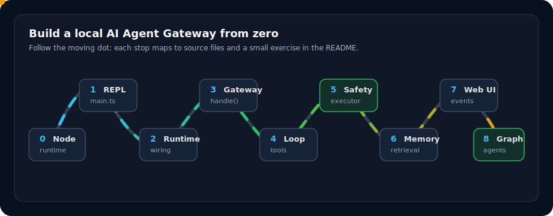
</p>

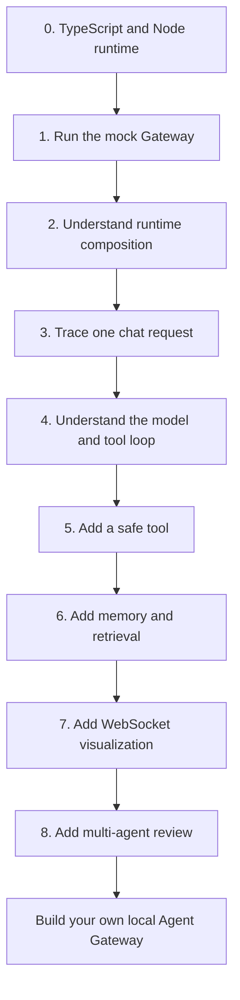

### 先学什么

| 阶段 | 你要掌握的东西 | 在本项目里看哪里 | 学完能做什么 |
| --- | --- | --- | --- |
| 0 | TypeScript、Node.js、Promise、文件系统、进程执行 | [`package.json`](package.json), [`tsconfig.json`](tsconfig.json) | 看懂脚本、类型检查和项目入口。 |
| 1 | 一个 CLI 程序如何启动 | [`apps/gateway/src/main.ts`](apps/gateway/src/main.ts) | 写出最小 REPL：读取输入并返回回答。 |
| 2 | 依赖如何组装成运行时 | [`packages/gateway/runtime.ts`](packages/gateway/runtime.ts) | 理解配置、模型、工具、记忆、会话怎样接到一起。 |
| 3 | 一次用户请求如何穿过系统 | [`packages/gateway/gateway.ts`](packages/gateway/gateway.ts) | 画出 request -> context -> model -> tool -> response 链路。 |
| 4 | LLM 工具调用循环 | [`packages/gateway/agentRunner.ts`](packages/gateway/agentRunner.ts) | 理解模型为什么能“决定调用工具”。 |
| 5 | 工具注册、校验和安全执行 | [`packages/gateway/builtinTools.ts`](packages/gateway/builtinTools.ts), [`packages/gateway/toolCallExecutor.ts`](packages/gateway/toolCallExecutor.ts) | 新增一个只读工具并写测试。 |
| 6 | 上下文、记忆和检索 | [`packages/gateway/contextBuilder.ts`](packages/gateway/contextBuilder.ts), [`packages/memory/src/hybridSearch.ts`](packages/memory/src/hybridSearch.ts) | 让 Agent 记住历史信息并在回答前检索。 |
| 7 | WebSocket 协议和可视化 | [`packages/gateway/ws/router.ts`](packages/gateway/ws/router.ts), [`packages/ws-client/src/gatewayClient.ts`](packages/ws-client/src/gatewayClient.ts), [`apps/web-ui/src/App.tsx`](apps/web-ui/src/App.tsx) | 把 CLI Agent 做成本地 Web 控制台。 |
| 8 | 多 Agent 工作流 | [`packages/gateway/reviewGraph/graphRunner.ts`](packages/gateway/reviewGraph/graphRunner.ts), [`packages/gateway/reviewGraph/subAgentRunner.ts`](packages/gateway/reviewGraph/subAgentRunner.ts) | 做出“计划、实现、测试、审查”的自动协作流程。 |

### 教学式源码导读

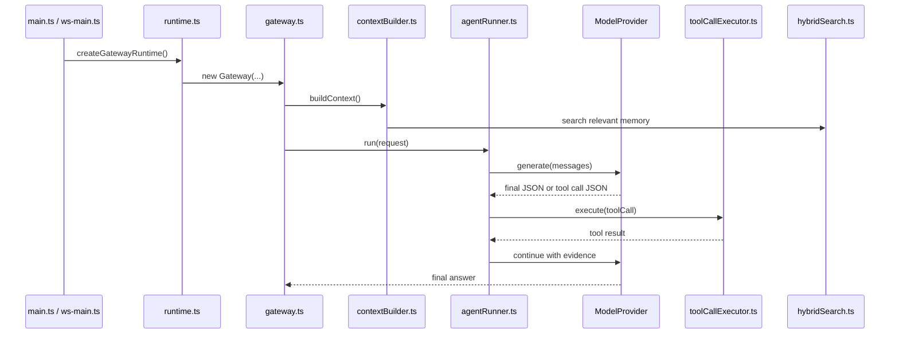

重点阅读这些 `Learning note` 注释：

| 注释位置 | 这段注释教什么 |
| --- | --- |
| [`packages/gateway/runtime.ts`](packages/gateway/runtime.ts) | Composition Root：配置、模型、记忆、工具、会话、MCP、指标如何被装配。 |
| [`packages/gateway/gateway.ts`](packages/gateway/gateway.ts) | Request Orchestrator：一次请求进入 Gateway 后如何被守卫、委托和归一化。 |
| [`packages/gateway/agentRunner.ts`](packages/gateway/agentRunner.ts) | LLM Control Loop：构建消息、调用模型、解析工具 JSON、执行工具、继续循环。 |
| [`packages/gateway/contextBuilder.ts`](packages/gateway/contextBuilder.ts) | Layered Context：系统提示、项目模式、记忆和用户任务怎样组合成 prompt。 |
| [`packages/gateway/toolCallExecutor.ts`](packages/gateway/toolCallExecutor.ts) | Tool Funnel：工具调用如何经过 schema、权限、沙箱和实际执行。 |
| [`packages/gateway/ws/router.ts`](packages/gateway/ws/router.ts) | WS API Surface：新增 WebSocket 方法应该改哪些地方。 |
| [`packages/memory/src/hybridSearch.ts`](packages/memory/src/hybridSearch.ts) | Hybrid Retrieval：全文检索和向量检索如何融合排序。 |

### 从最小 Agent 开始复刻

```text
step-01  CLI loop
         read user input -> print model response

step-02  model provider
         define ModelProvider.generate(messages)

step-03  structured output
         require model to return { "type": "final", "text": "..." }

step-04  first tool
         add file.read with schema validation

step-05  tool loop
         model returns { "type": "tool_call", "name": "...", "input": {...} }

step-06  safety layer
         block path escape and dangerous shell commands

step-07  memory
         write notes, index notes, retrieve relevant snippets

step-08  WebSocket UI
         emit run.started, tool.started, chat.delta, run.finished

step-09  multi-agent
         split work into explore -> plan -> implement -> test -> review
```

### 动手练习

| 练习 | 修改范围 | 验收方式 |
| --- | --- | --- |
| 写一个最小 REPL | 新建实验文件，参考 [`apps/gateway/src/main.ts`](apps/gateway/src/main.ts) | 输入一句话，终端能输出固定回答。 |
| 接入 Mock Model | 参考 [`packages/model/mockProvider.ts`](packages/model/mockProvider.ts) | 不配置 API Key 也能跑通一次请求。 |
| 新增只读工具 `repo.countFiles` | [`packages/gateway/tools/repoTools.ts`](packages/gateway/tools/repoTools.ts) 或新建工具文件，再注册到 [`packages/gateway/builtinTools.ts`](packages/gateway/builtinTools.ts) | `tool.list` 能看到工具，`tool.call` 能返回文件数量。 |
| 给工具加安全策略 | [`packages/gateway/toolCallExecutor.ts`](packages/gateway/toolCallExecutor.ts), [`packages/gateway/permissionPolicy.ts`](packages/gateway/permissionPolicy.ts) | 越界路径被拒绝，并写入审计。 |
| 给上下文加一层项目摘要 | [`packages/gateway/contextBuilder.ts`](packages/gateway/contextBuilder.ts) | 模型请求前能看到项目摘要消息。 |
| 新增 WS 方法 `runtime.pingDetailed` | [`packages/gateway/ws/schemas.ts`](packages/gateway/ws/schemas.ts), [`packages/gateway/ws/router.ts`](packages/gateway/ws/router.ts) | WebSocket 调用返回模型名、时间和会话数。 |
| 新增一个 ReviewGraph 节点 | [`packages/gateway/reviewGraph/graphRunner.ts`](packages/gateway/reviewGraph/graphRunner.ts) | 多 Agent 报告里出现新节点结果。 |

### 推荐阅读顺序

1. [`packages/gateway/runtime.ts`](packages/gateway/runtime.ts)：先看系统如何被组装。
2. [`apps/gateway/src/main.ts`](apps/gateway/src/main.ts)：再看 REPL 如何调用运行时。
3. [`packages/gateway/gateway.ts`](packages/gateway/gateway.ts)：理解请求总入口。
4. [`packages/gateway/contextBuilder.ts`](packages/gateway/contextBuilder.ts)：理解 prompt 从哪里来。
5. [`packages/gateway/agentRunner.ts`](packages/gateway/agentRunner.ts)：理解 Agent 循环。
6. [`packages/gateway/toolCallExecutor.ts`](packages/gateway/toolCallExecutor.ts)：理解工具安全执行。
7. [`packages/gateway/builtinTools.ts`](packages/gateway/builtinTools.ts)：理解工具如何注册。
8. [`packages/gateway/ws/router.ts`](packages/gateway/ws/router.ts)：理解 UI 和 Gateway 如何通信。
9. [`apps/web-ui/src/App.tsx`](apps/web-ui/src/App.tsx)：理解前端如何展示运行过程。
10. [`packages/gateway/reviewGraph/graphRunner.ts`](packages/gateway/reviewGraph/graphRunner.ts)：最后看多 Agent 自动化。

### 学习成果检查表

- 能解释 `Gateway.handle()` 和 `AgentRunner.run()` 的职责边界。
- 能说明为什么工具调用不能绕过 `ToolCallExecutor`。
- 能新增一个工具，并补上 schema、权限策略和测试。
- 能说清楚 prompt 由哪些层组成，哪些内容不应该直接塞进上下文。
- 能解释 FTS、向量检索和 RRF 融合在记忆系统里的作用。
- 能新增一个 WebSocket 方法，并让前端展示它的结果。
- 能把一个复杂开发任务拆成 Explore、Plan、Implement、Test、Verify、Security、Reviewer。

## 项目结构

```text
agent-rebuild/
+-- apps/
|   +-- gateway/                # REPL 与 WebSocket 启动入口
|   +-- web-ui/                 # React 本地 Agent Console
+-- packages/
|   +-- audit/                  # 审计日志类型与写入
|   +-- core/                   # 共享 bootstrap、config、skills 和 types
|   +-- gateway/                # Runtime、tools、policy、WS、context、ReviewGraph
|   +-- memory/                 # Memory indexing、embeddings、hybrid search、writing
|   +-- model/                  # ModelProvider 抽象与适配器
|   +-- session/                # Transcript 与 compaction helpers
|   +-- storage/                # SQLite storage layer
|   +-- ws-client/              # WebSocket client SDK
+-- docs/                       # WebSocket protocol、安全文档、架构图与 assets
+-- scripts/                    # Indexing、smoke tests、detection、eval、maintenance
+-- tests/                      # Unit、integration、WebSocket、Gateway tests
+-- workspace/                  # Local memory、skills、user notes、agent workspace
```

## 关键入口

| 文件 | 作用 |
| --- | --- |
| `apps/gateway/src/main.ts` | REPL 启动入口。 |
| `apps/gateway/src/ws-main.ts` | WebSocket server 启动入口。 |
| `packages/gateway/runtime.ts` | Runtime composition root。 |
| `packages/gateway/gateway.ts` | 请求编排与 Gateway handling。 |
| `packages/gateway/agentRunner.ts` | Model / tool loop 与 DevTask execution。 |
| `packages/gateway/contextBuilder.ts` | Prompt 与 context assembly。 |
| `packages/gateway/toolCallExecutor.ts` | Tool validation、policy、execution 与 result capture。 |
| `packages/gateway/ws/router.ts` | WebSocket request routing。 |
| `packages/memory/src/hybridSearch.ts` | FTS / vector hybrid retrieval。 |
| `apps/web-ui/src/App.tsx` | Web UI shell。 |

## WebSocket API

协议版本：`1.0`。

常用请求方法：

```text
connect
ping
runtime.status
runtime.updateConfig
session.list
session.get
session.create
session.rename
session.delete
session.purge
session.bindProject
session.getTranscript
chat.send
chat.cancel
memory.search
memory.write
mcp.status
mcp.tools
mcp.config.add
skills.list
skills.current
skills.use
skills.clear
tool.list
tool.call
approval.list
approval.confirm
approval.reject
audit.tail
```

常用服务端事件：

```text
connected
heartbeat
run.started
run.progress
chat.delta
chat.completed
tool.started
tool.finished
tool.failed
tool.denied
approval.required
session.updated
audit.append
run.finished
run.failed
run.cancelled
state.resync_required
server.shutdown
```

完整协议见：

- [WebSocket Protocol](docs/ws-protocol.md)
- [WebSocket Gateway](docs/ws-gateway.md)
- [WebSocket Security](docs/ws-security.md)
- [Final Checklist](docs/ws-final-checklist.md)

## 配置速查

| 变量 | 默认 / 示例 | 说明 |
| --- | --- | --- |
| `GATEWAY_MODEL` | `tokenplan` / `mock` | 当前模型提供商。 |
| `TOKENPLAN_API_KEY` | 空 | MiniMax TokenPlan API Key。 |
| `TOKENPLAN_MODEL` | `codex-MiniMax-M2.7` | TokenPlan 模型名。 |
| `WORKSPACE_ROOT` | `...\workspace` | 本地记忆和工作区根目录。 |
| `GATEWAY_SANDBOX_ALLOWED_ROOTS` | project root and workspace | 允许读写的本机路径。 |
| `GATEWAY_AUTO_TOOL_LOOP_ENABLED` | `true` | 是否启用自动工具循环。 |
| `GATEWAY_AUTO_REVIEW_GRAPH_ENABLED` | `false` | 是否启用 **Experimental** ReviewGraph。 |
| `GATEWAY_WS_HOST` | `127.0.0.1` | WebSocket server host。 |
| `GATEWAY_WS_PORT` | `8787` | WebSocket server port。 |
| `GATEWAY_WS_TOKEN` | 空 | WebSocket 鉴权 token。 |
| `EMBEDDING_PROVIDER` | `mock` | `mock` 或 `dashscope` embeddings。 |
| `DASHSCOPE_API_KEY` | 空 | DashScope embedding API key。 |
| `TAVILY_API_KEY` | 空 | Tavily web search API key。 |

更多配置见 [.env.example](.env.example)。

## 质量验证

修改核心链路后建议运行：

```bash
npm run typecheck
npm test
npm run gateway:smoke:all
npm run gateway:detect
```

涉及 Web UI 时额外运行：

```bash
npm run web:build
```

完整本地检查：

```bash
npm run gateway:check
```

## Roadmap

| 状态 | 方向 |
| --- | --- |
| WIP | 更强的代码仓库索引、模块摘要和 codebase retrieval。 |
| WIP | 更完整的 Web UI 运行诊断、审批、记忆和工具时间线可视化。 |
| WIP | token、cost、latency、cache hit、failure observability。 |
| Experimental | ReviewGraph 多 Agent 开发任务工作流。 |
| Experimental | MCP tool discovery 与外部 tool server runtime registration。 |
| Roadmap | 可恢复事件流、长任务和多客户端状态同步。 |
| Roadmap | 更细粒度的工具权限、审批 UX 和 safety profiles。 |

生产化设计参考：[PRODUCTION_ARCHITECTURE.md](PRODUCTION_ARCHITECTURE.md)。

## Tech Stack

| 层 | 技术 |
| --- | --- |
| Runtime | Node.js、TypeScript、tsx |
| Gateway transport | REPL、WebSocket (`ws`) |
| Frontend | React 19、Vite 6、Zustand、react-markdown |
| Storage | SQLite via `better-sqlite3`、JSONL logs、Markdown files |
| Memory | SQLite FTS、vector search、DashScope 或 mock embeddings |
| Model access | OpenAI-compatible provider、MiniMax TokenPlan adapter、mock provider |
| Tooling | TypeScript compiler、Node test runner、smoke / detection scripts |
| External integrations | MCP SDK、Tavily web search、DashScope embeddings |

## FAQ

| 问题 | 处理方式 |
| --- | --- |
| Gateway 启动后立即退出 | 确认 Node.js >= 18，并检查 `.env` 中模型 API Key 或 `GATEWAY_MODEL=mock`。 |
| Web UI 连接失败 | 确认 `npm run gateway:ws` 正在运行，并检查 `GATEWAY_WS_PORT` 与 `VITE_GATEWAY_WS_URL`。 |
| Shell 命令被拒绝 | 检查 cwd 是否在 `GATEWAY_SANDBOX_ALLOWED_ROOTS` 内，或命令是否被危险规则拦截。 |
| 记忆检索无结果 | 使用 `npm run reindex` 重建索引，并确认 `WORKSPACE_ROOT` 正确。 |
| Web 搜索不可用 | 设置 `TAVILY_API_KEY`。 |
| 向量检索不可用 | 设置 `DASHSCOPE_API_KEY` 或使用 `EMBEDDING_PROVIDER=mock`。 |

---

## English

[中文](#agent-rebuild) | **English**

Agent Rebuild is an experimental TypeScript agent runtime inspired by OpenClaw and Claude Code. It is built around long-term memory, controlled tool execution, Gateway orchestration, MCP integration, WebSocket access, context compression, permission policy, and auditable execution records.

It is not just a chatbot shell. The runtime is designed as local agent infrastructure for development tasks: requests can enter through the REPL, WebSocket clients, or the React Web UI; the Gateway assembles context, calls the model provider, executes tools under policy, persists transcripts, and records audit evidence.

### What It Does

- Runs a local Gateway through REPL or WebSocket.
- Uses Markdown memory, daily notes, SQLite FTS, embeddings, and hybrid retrieval.
- Executes model-generated tool calls through a permissioned tool registry.
- Protects file and shell access with workspace boundaries, command risk checks, approvals, and audit logs.
- Maintains transcripts, session recovery metadata, rolling summaries, long-term memory, and compressed context.
- Provides a React Web UI for sessions, chat runs, streaming output, tool timelines, approvals, memory, and audit views.
- Supports MCP tool discovery and registration through a manager / adapter layer.
- Includes an **Experimental** ReviewGraph workflow for explore, plan, implement, test, verify, security review, and final review.

### Architecture

The core runtime is split into Gateway Runtime, Context Builder, Memory Core, Tool System, MCP Manager, Model Provider, Audit & Safety, and Session Store. Storage is backed by Markdown files, SQLite, JSONL logs, and persisted tool results.

See the diagrams above:

- [System Architecture](#system-architecture)
- [Memory Pipeline](#memory-pipeline)
- [Tool Execution Loop](#tool-execution-loop)
- [Learning Path](#学习路线图)

### Quick Start

```bash
git clone https://github.com/yfrcg/agent-rebuild.git
cd agent-rebuild
npm install
copy .env.example .env
```

Set at least:

```env
GATEWAY_MODEL=tokenplan
TOKENPLAN_API_KEY=your_api_key
WINDOWS_PROJECT_ROOT=D:\WorkStation\agent-rebuild
WORKSPACE_ROOT=D:\WorkStation\agent-rebuild\workspace
GATEWAY_SANDBOX_ALLOWED_ROOTS=D:\WorkStation\agent-rebuild;D:\WorkStation\agent-rebuild\workspace
```

Run the REPL:

```bash
npm run gateway
```

Run the WebSocket Gateway and Web UI:

```bash
npm run gateway:ws
npm run web:dev
```

### Main Commands

| Command | Purpose |
| --- | --- |
| `npm run gateway` | Start the local REPL Gateway. |
| `npm run gateway:ws` | Start the WebSocket Gateway. |
| `npm run web:dev` | Start the React Web UI through Vite. |
| `npm run web:build` | Type-check and build the Web UI. |
| `npm run typecheck` | Run TypeScript checks without emit. |
| `npm test` | Run the repository test suite. |
| `npm run reindex` | Rebuild memory indexes. |
| `npm run gateway:smoke:all` | Run Gateway smoke checks. |
| `npm run gateway:detect` | Run offline system detection. |
| `npm run gateway:check` | Run typecheck, build, tests, smoke checks, and offline detection. |

### Documentation

- [WebSocket Protocol](docs/ws-protocol.md)
- [WebSocket Gateway](docs/ws-gateway.md)
- [WebSocket Security](docs/ws-security.md)
- [Final Checklist](docs/ws-final-checklist.md)
- [Production Architecture](PRODUCTION_ARCHITECTURE.md)

## License

ISC
