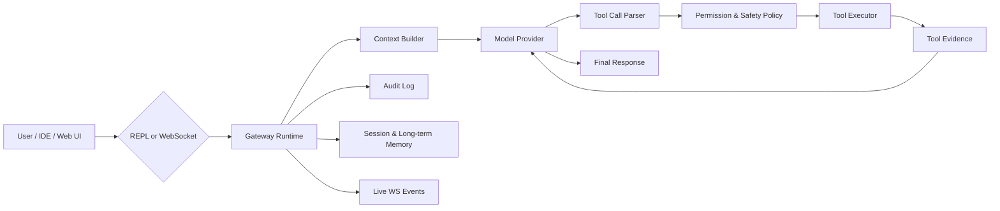
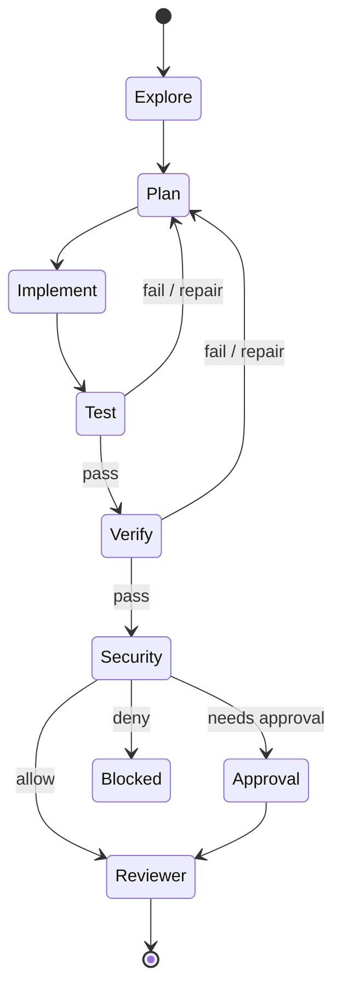
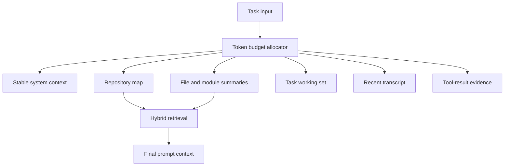
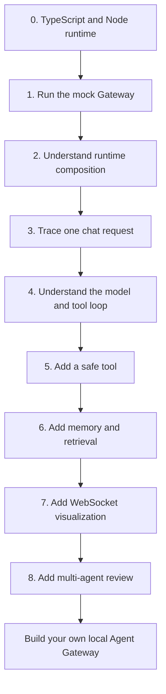
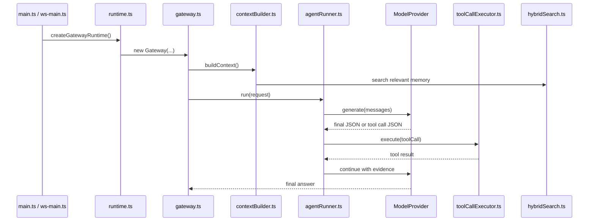

# agent-rebuild

**中文** | [English](#english)

AI Agent Gateway for Windows-native local development. It turns model responses, tool calls, file edits, shell commands, memory, audit logs, WebSocket events, and a local console UI into one controllable runtime.

> Windows-first. Node.js >= 18. No Docker, WSL, or external sandbox runtime required.

[](package.json)
[](#快速开始)
[](docs/ws-protocol.md)
[](#license)

## 项目介绍

`agent-rebuild` 是一个本地 AI Agent 控制层。它不是简单的聊天壳，而是把 Agent 的关键动作统一放进 Gateway：

- **模型推理**：支持 MiniMax TokenPlan 与 Mock Provider，运行时可切换。
- **工具调用**：文件、Shell、Git、测试、Web、Todo、记忆、审计、MCP 动态工具统一注册和执行。
- **安全边界**：路径守卫、命令拦截、风险分级、审批令牌、审计日志和会话级权限策略。
- **上下文工程**：记忆检索、会话工作记忆、滚动摘要、上下文压缩、代码索引和 token 预算控制。
- **多 Agent 协作**：ReviewGraph 支持探索、计划、实现、测试、验证、安全审计和最终评审。
- **本地可视化**：Web UI 通过 WebSocket 展示会话、流式输出、工具时间线、审批、记忆和审计。

项目目标是提供一个可运行、可观察、可扩展的本地 Agent Gateway，用于开发任务、代码仓库维护、自动化验证和 Agent 工程研究。

## 视觉总览

### 运行链路



### 本地控制台布局

```text
+----------------------+--------------------------------------+----------------------+
| Sessions / Navigation | Chat, runs, streaming output          | Timeline / Events    |
|                      |                                      |                      |
| - Recent sessions    | - User and assistant messages         | - run.started        |
| - Project binding    | - Tool calls and outputs              | - chat.delta         |
| - Memory / audit     | - DevTask and ReviewGraph progress    | - tool.finished      |
| - Approvals          | - Runtime status summary              | - approval.required  |
+----------------------+--------------------------------------+----------------------+
```

### 多 Agent ReviewGraph



### 上下文与检索



## 核心能力

| 能力 | 说明 |
| --- | --- |
| Gateway Runtime | REPL 和 WebSocket 共享同一运行时，模型、工具、记忆、会话、审计统一调度。 |
| Tool Registry | 内建 29 个工具，并支持 MCP 工具动态发现和运行时注册。 |
| Safety Policy | 工作区路径限制、敏感文件保护、危险命令拦截、审批和审计日志。 |
| Session Memory | 每个会话持久化 transcript、工作记忆、滚动摘要、决策和待处理问题。 |
| Long-term Memory | SQLite FTS5 + 向量检索 + RRF 融合排序，支持自动写入和压缩。 |
| Context Compression | 4-tier 压缩管线，降低长会话和大工具结果带来的上下文压力。 |
| WebSocket Console | 本地 Web UI 可视化 run 生命周期、流式 token、工具调用、审批和审计。 |
| ReviewGraph | 多 Agent 协作流水线，面向开发任务提供计划、实现、测试、验证和安全审查。 |

## 快速开始

### 环境要求

- Windows 10/11
- Node.js >= 18
- MiniMax TokenPlan API Key，用于真实模型推理
- DashScope API Key，可选，用于向量检索
- Tavily API Key，可选，用于 Web 搜索

### 安装

```bash
git clone https://github.com/yfrcg/agent-rebuild.git
cd agent-rebuild
npm install
copy .env.example .env
```

编辑 `.env`，至少设置：

```env
GATEWAY_MODEL=tokenplan
TOKENPLAN_API_KEY=your_api_key
WINDOWS_PROJECT_ROOT=D:\WorkStation\agent-rebuild
WORKSPACE_ROOT=D:\WorkStation\agent-rebuild\workspace
GATEWAY_SANDBOX_ALLOWED_ROOTS=D:\WorkStation\agent-rebuild;D:\WorkStation\agent-rebuild\workspace
```

如果只想离线验证流程，可以使用：

```env
GATEWAY_MODEL=mock
EMBEDDING_PROVIDER=mock
```

### REPL 模式

```bash
npm run gateway
```

启动后直接输入任务。Gateway 会根据模型输出执行受控工具调用，并把最终结果返回到终端。

### Web UI 模式

建议开两个终端：

```bash
npm run gateway:ws
npm run web:dev
```

Web UI 默认通过 `VITE_GATEWAY_WS_URL` 连接 Gateway。未配置时使用 `/v1/ws`；本地开发可配置为：

```env
VITE_GATEWAY_WS_URL=ws://127.0.0.1:8787/v1/ws
```

## 常用脚本

| 命令 | 用途 |
| --- | --- |
| `npm run gateway` | 启动 REPL Gateway。 |
| `npm run gateway:ws` | 启动 WebSocket Gateway。 |
| `npm run web:dev` | 启动本地 Web UI。 |
| `npm run web:build` | 构建 Web UI。 |
| `npm run typecheck` | TypeScript 类型检查。 |
| `npm test` | 运行测试套件。 |
| `npm run gateway:smoke:all` | Gateway 冒烟测试。 |
| `npm run gateway:detect` | 离线系统检测。 |
| `npm run gateway:check` | 类型检查、构建、测试、冒烟和系统检测。 |

## 工具系统

| 分组 | 工具示例 | 说明 |
| --- | --- | --- |
| 文件 | `file.read`, `file.write`, `file.edit`, `file.glob`, `file.patch` | 受工作区和路径策略保护的文件操作。 |
| Shell | `shell.run`, `bash.run`, `npm_test`, `build` | PowerShell 本地执行，带 cwd 限制、超时和危险命令拦截。 |
| Git | `git.status`, `git.diff`, `git.commit` | 仓库状态、差异和提交辅助。 |
| 开发验证 | `typecheck.run`, `lint.run`, `verify.run` | 类型检查、lint、测试和构建流水线。 |
| Web | `web.fetch`, `web.search` | 页面抓取和 Tavily 搜索。 |
| Todo | `todo.write`, `todo.update`, `todo.list` | 会话任务管理。 |
| Agent | `agent.verify`, `policy.check`, `audit.query` | 独立验证、安全策略检查和审计查询。 |
| 记忆 | `memory.search`, `memory.write` | 混合检索和长期记忆写入。 |
| Skill / MCP | `skill`, `mcp.*` | 本地 Skill 调用和 MCP 插件工具。 |

所有工具调用都会进入 `ToolCallExecutor`，经过 schema 校验、权限策略、安全画像、审计记录和结果截断。

## 从 0 学做一个智能体

这一节面向第一次学习 Agent 工程的读者。目标不是一次读完所有源码，而是按“能跑起来 -> 能理解一次请求 -> 能加一个工具 -> 能做记忆和 UI -> 能做多 Agent”的顺序，把这个项目当成一本可运行的教学指导书。

源码里已经放了少量 `Learning note` 注释。阅读时可以在编辑器里搜索 `Learning note`，它们是主链路上的教学路标：每个注释都标在一个“应该停下来理解”的函数附近。

### 学习路线图



### 先学什么

| 阶段 | 你要掌握的东西 | 在本项目里看哪里 | 学完能做什么 |
| --- | --- | --- | --- |
| 0 | TypeScript、Node.js、Promise、文件系统、进程执行 | [`package.json`](package.json), [`tsconfig.json`](tsconfig.json) | 看懂脚本、类型检查和项目入口。 |
| 1 | 一个 CLI 程序如何启动 | [`apps/gateway/src/main.ts`](apps/gateway/src/main.ts) | 写出最小 REPL：读取输入并返回回答。 |
| 2 | 依赖如何组装成运行时 | [`packages/gateway/runtime.ts`](packages/gateway/runtime.ts) | 理解配置、模型、工具、记忆、会话怎样接到一起。 |
| 3 | 一次用户请求如何穿过系统 | [`packages/gateway/gateway.ts`](packages/gateway/gateway.ts) | 画出 request -> context -> model -> tool -> response 链路。 |
| 4 | LLM 工具调用循环 | [`packages/gateway/agentRunner.ts`](packages/gateway/agentRunner.ts) | 理解模型为什么能“决定调用工具”。 |
| 5 | 工具注册、校验和安全执行 | [`packages/gateway/builtinTools.ts`](packages/gateway/builtinTools.ts), [`packages/gateway/toolCallExecutor.ts`](packages/gateway/toolCallExecutor.ts) | 新增一个只读工具并写测试。 |
| 6 | 上下文、记忆和检索 | [`packages/gateway/contextBuilder.ts`](packages/gateway/contextBuilder.ts), [`packages/memory/src/hybridSearch.ts`](packages/memory/src/hybridSearch.ts) | 让 Agent 记住历史信息并在回答前检索。 |
| 7 | WebSocket 协议和可视化 | [`packages/gateway/ws/router.ts`](packages/gateway/ws/router.ts), [`packages/ws-client/src/gatewayClient.ts`](packages/ws-client/src/gatewayClient.ts), [`apps/web-ui/src/App.tsx`](apps/web-ui/src/App.tsx) | 把 CLI Agent 做成本地 Web 控制台。 |
| 8 | 多 Agent 工作流 | [`packages/gateway/reviewGraph/graphRunner.ts`](packages/gateway/reviewGraph/graphRunner.ts), [`packages/gateway/reviewGraph/subAgentRunner.ts`](packages/gateway/reviewGraph/subAgentRunner.ts) | 做出“计划、实现、测试、审查”的自动协作流程。 |

### 教学式源码导读



重点阅读这些 `Learning note` 注释：

| 注释位置 | 这段注释教什么 |
| --- | --- |
| [`packages/gateway/runtime.ts`](packages/gateway/runtime.ts) | Composition Root：配置、模型、记忆、工具、会话、MCP、指标如何被装配。 |
| [`packages/gateway/gateway.ts`](packages/gateway/gateway.ts) | Request Orchestrator：一次请求进入 Gateway 后如何被守卫、委托和归一化。 |
| [`packages/gateway/agentRunner.ts`](packages/gateway/agentRunner.ts) | LLM Control Loop：构建消息、调用模型、解析工具 JSON、执行工具、继续循环。 |
| [`packages/gateway/contextBuilder.ts`](packages/gateway/contextBuilder.ts) | Layered Context：系统提示、项目模式、记忆和用户任务怎样组合成 prompt。 |
| [`packages/gateway/toolCallExecutor.ts`](packages/gateway/toolCallExecutor.ts) | Tool Funnel：工具调用如何经过 schema、权限、沙箱和实际执行。 |
| [`packages/gateway/ws/router.ts`](packages/gateway/ws/router.ts) | WS API Surface：新增 WebSocket 方法应该改哪些地方。 |
| [`packages/memory/src/hybridSearch.ts`](packages/memory/src/hybridSearch.ts) | Hybrid Retrieval：全文检索和向量检索如何融合排序。 |

### 从最小 Agent 开始复刻

如果你想从空目录做一个简化版，可以按下面的里程碑复刻。每一步都先做最小可运行版本，再回到本项目看完整实现。

```text
step-01  CLI loop
         read user input -> print model response

step-02  model provider
         define ModelProvider.generate(messages)

step-03  structured output
         require model to return { "type": "final", "text": "..." }

step-04  first tool
         add file.read with schema validation

step-05  tool loop
         model returns { "type": "tool_call", "name": "...", "input": {...} }

step-06  safety layer
         block path escape and dangerous shell commands

step-07  memory
         write notes, index notes, retrieve relevant snippets

step-08  WebSocket UI
         emit run.started, tool.started, chat.delta, run.finished

step-09  multi-agent
         split work into explore -> plan -> implement -> test -> review
```

### 动手练习

| 练习 | 修改范围 | 验收方式 |
| --- | --- | --- |
| 写一个最小 REPL | 新建实验文件，参考 [`apps/gateway/src/main.ts`](apps/gateway/src/main.ts) | 输入一句话，终端能输出固定回答。 |
| 接入 Mock Model | 参考 [`packages/model/mockProvider.ts`](packages/model/mockProvider.ts) | 不配置 API Key 也能跑通一次请求。 |
| 新增只读工具 `repo.countFiles` | [`packages/gateway/tools/repoTools.ts`](packages/gateway/tools/repoTools.ts) 或新建工具文件，再注册到 [`packages/gateway/builtinTools.ts`](packages/gateway/builtinTools.ts) | `tool.list` 能看到工具，`tool.call` 能返回文件数量。 |
| 给工具加安全策略 | [`packages/gateway/toolCallExecutor.ts`](packages/gateway/toolCallExecutor.ts), [`packages/gateway/permissionPolicy.ts`](packages/gateway/permissionPolicy.ts) | 越界路径被拒绝，并写入审计。 |
| 给上下文加一层项目摘要 | [`packages/gateway/contextBuilder.ts`](packages/gateway/contextBuilder.ts) | 模型请求前能看到项目摘要消息。 |
| 新增 WS 方法 `runtime.pingDetailed` | [`packages/gateway/ws/schemas.ts`](packages/gateway/ws/schemas.ts), [`packages/gateway/ws/router.ts`](packages/gateway/ws/router.ts) | WebSocket 调用返回模型名、时间和会话数。 |
| 新增一个 ReviewGraph 节点 | [`packages/gateway/reviewGraph/graphRunner.ts`](packages/gateway/reviewGraph/graphRunner.ts) | 多 Agent 报告里出现新节点结果。 |

### 推荐阅读顺序

1. [`packages/gateway/runtime.ts`](packages/gateway/runtime.ts)：先看系统如何被组装。
2. [`apps/gateway/src/main.ts`](apps/gateway/src/main.ts)：再看 REPL 如何调用运行时。
3. [`packages/gateway/gateway.ts`](packages/gateway/gateway.ts)：理解请求总入口。
4. [`packages/gateway/contextBuilder.ts`](packages/gateway/contextBuilder.ts)：理解 prompt 从哪里来。
5. [`packages/gateway/agentRunner.ts`](packages/gateway/agentRunner.ts)：理解 Agent 循环。
6. [`packages/gateway/toolCallExecutor.ts`](packages/gateway/toolCallExecutor.ts)：理解工具安全执行。
7. [`packages/gateway/builtinTools.ts`](packages/gateway/builtinTools.ts)：理解工具如何注册。
8. [`packages/gateway/ws/router.ts`](packages/gateway/ws/router.ts)：理解 UI 和 Gateway 如何通信。
9. [`apps/web-ui/src/App.tsx`](apps/web-ui/src/App.tsx)：理解前端如何展示运行过程。
10. [`packages/gateway/reviewGraph/graphRunner.ts`](packages/gateway/reviewGraph/graphRunner.ts)：最后看多 Agent 自动化。

### 学习成果检查表

- 能解释 `Gateway.handle()` 和 `AgentRunner.run()` 的职责边界。
- 能说明为什么工具调用不能绕过 `ToolCallExecutor`。
- 能新增一个工具，并补上 schema、权限策略和测试。
- 能说清楚 prompt 由哪些层组成，哪些内容不应该直接塞进上下文。
- 能解释 FTS、向量检索和 RRF 融合在记忆系统里的作用。
- 能新增一个 WebSocket 方法，并让前端展示它的结果。
- 能把一个复杂开发任务拆成 Explore、Plan、Implement、Test、Verify、Security、Reviewer。

## 架构模块

```text
agent-rebuild/
├── apps/
│   ├── gateway/                 # REPL 与 WebSocket 启动入口
│   └── web-ui/                  # React 本地 Agent Console
├── packages/
│   ├── gateway/                 # Gateway 核心运行时、工具、安全、WS、ReviewGraph
│   ├── ws-client/               # WebSocket 客户端 SDK
│   ├── memory/                  # 记忆检索、写入、向量和压缩
│   ├── model/                   # ModelProvider 接口与模型适配
│   ├── storage/                 # SQLite 存储
│   ├── session/                 # transcript 和摘要工具
│   ├── core/                    # 共享类型和 bootstrap
│   └── audit/                   # 审计日志类型与写入
├── docs/                        # WebSocket 协议、安全和交付检查文档
├── scripts/                     # 冒烟、检测、索引、评估和维护脚本
├── tests/                       # 单元、集成和 Gateway 行为测试
└── workspace/                   # 本地记忆、Skill 和会话工作区
```

### 关键入口

| 入口 | 说明 |
| --- | --- |
| [`apps/gateway/src/main.ts`](apps/gateway/src/main.ts) | REPL 启动入口。 |
| [`apps/gateway/src/ws-main.ts`](apps/gateway/src/ws-main.ts) | WebSocket 服务启动入口。 |
| [`packages/gateway/runtime.ts`](packages/gateway/runtime.ts) | 共享运行时工厂。 |
| [`packages/gateway/gateway.ts`](packages/gateway/gateway.ts) | Gateway 主类和 `handle()` 链路。 |
| [`packages/gateway/agentRunner.ts`](packages/gateway/agentRunner.ts) | LLM 循环、工具解析、DevTask。 |
| [`packages/gateway/toolCallExecutor.ts`](packages/gateway/toolCallExecutor.ts) | 工具执行与安全校验。 |
| [`packages/gateway/ws/router.ts`](packages/gateway/ws/router.ts) | WebSocket 请求路由。 |
| [`apps/web-ui/src/App.tsx`](apps/web-ui/src/App.tsx) | Web UI 主界面。 |

## WebSocket API

协议版本：`1.0`

常用方法：

```text
connect
runtime.status
session.list
session.create
session.bindProject
chat.send
chat.cancel
memory.search
memory.write
tool.list
tool.call
approval.list
approval.confirm
approval.reject
audit.tail
```

常用事件：

```text
connected
run.started
run.progress
chat.delta
chat.completed
tool.started
tool.finished
tool.denied
approval.required
session.updated
audit.append
run.finished
```

完整协议见：

- [docs/ws-protocol.md](docs/ws-protocol.md)
- [docs/ws-gateway.md](docs/ws-gateway.md)
- [docs/ws-security.md](docs/ws-security.md)
- [docs/ws-final-checklist.md](docs/ws-final-checklist.md)

## 配置速查

| 变量 | 默认 / 示例 | 说明 |
| --- | --- | --- |
| `GATEWAY_MODEL` | `tokenplan` / `mock` | 当前模型提供商。 |
| `TOKENPLAN_API_KEY` | 空 | MiniMax TokenPlan API Key。 |
| `TOKENPLAN_MODEL` | `codex-MiniMax-M2.7` | TokenPlan 模型名。 |
| `WORKSPACE_ROOT` | `...\workspace` | 默认工作区。 |
| `GATEWAY_SANDBOX_ALLOWED_ROOTS` | 项目根目录和 workspace | 允许读写的本机路径。 |
| `GATEWAY_AUTO_TOOL_LOOP_ENABLED` | `true` | 是否启用自动工具循环。 |
| `GATEWAY_AUTO_REVIEW_GRAPH_ENABLED` | `false` | 是否启用 ReviewGraph。 |
| `GATEWAY_WS_PORT` | `8787` | WebSocket 服务端口。 |
| `GATEWAY_WS_TOKEN` | 空 | WebSocket 鉴权 token。 |
| `EMBEDDING_PROVIDER` | `mock` | 向量提供商。 |
| `DASHSCOPE_API_KEY` | 空 | DashScope 向量 API Key。 |
| `TAVILY_API_KEY` | 空 | Web 搜索 API Key。 |

更多配置见 [.env.example](.env.example)。

## 质量验证

推荐在修改核心链路后运行：

```bash
npm run typecheck
npm test
npm run gateway:smoke:all
npm run gateway:detect
```

涉及 Web UI 时额外运行：

```bash
npm run web:build
```

完整本地检查：

```bash
npm run gateway:check
```

## 路线图

当前重点方向：

- 更强的代码仓库索引和模块摘要。
- token / cost / latency / cache hit 观测指标。
- 可恢复的事件流、长任务和多客户端状态同步。
- 更细粒度的工具权限、审批和风险画像。
- 更完整的 Web UI 可视化和运行诊断。

生产化设计参考：[PRODUCTION_ARCHITECTURE.md](PRODUCTION_ARCHITECTURE.md)

## FAQ

| 问题 | 处理方式 |
| --- | --- |
| Gateway 启动后立即退出 | 确认 Node.js >= 18，并检查 `.env` 中模型 API Key 或 `GATEWAY_MODEL=mock`。 |
| Web UI 连接失败 | 确认 `npm run gateway:ws` 正在运行，并检查 `GATEWAY_WS_PORT` 与 `VITE_GATEWAY_WS_URL`。 |
| Shell 命令被拒绝 | 检查 cwd 是否在 `GATEWAY_SANDBOX_ALLOWED_ROOTS` 内，或命令是否被危险规则拦截。 |
| 记忆检索无结果 | 使用 `npm run reindex` 重建索引，并确认 `WORKSPACE_ROOT` 正确。 |
| Web 搜索不可用 | 设置 `TAVILY_API_KEY`。 |
| 向量检索不可用 | 设置 `DASHSCOPE_API_KEY` 或使用 `EMBEDDING_PROVIDER=mock`。 |

---

## English

[中文](#agent-rebuild) | **English**

`agent-rebuild` is a Windows-native local AI Agent Gateway. It centralizes model calls, tool execution, file writes, shell commands, memory, audit logs, WebSocket transport, and a local console UI into one controlled runtime.

### What It Does

- Runs a local Gateway through either REPL or WebSocket.
- Executes model-generated tool calls through a permissioned tool registry.
- Protects file and shell access with workspace boundaries, command checks, risk profiles, approvals, and audit logs.
- Maintains session memory, rolling summaries, long-term memory, and compressed context.
- Provides a React Web UI for chat, streaming output, tool timelines, approvals, memory, and audit views.
- Supports ReviewGraph, a multi-agent workflow for explore, plan, implement, test, verify, security review, and final review.

### Quick Start

```bash
git clone https://github.com/yfrcg/agent-rebuild.git
cd agent-rebuild
npm install
copy .env.example .env
```

Set at least:

```env
GATEWAY_MODEL=tokenplan
TOKENPLAN_API_KEY=your_api_key
WINDOWS_PROJECT_ROOT=D:\WorkStation\agent-rebuild
WORKSPACE_ROOT=D:\WorkStation\agent-rebuild\workspace
GATEWAY_SANDBOX_ALLOWED_ROOTS=D:\WorkStation\agent-rebuild;D:\WorkStation\agent-rebuild\workspace
```

Run the REPL:

```bash
npm run gateway
```

Run the Web UI:

```bash
npm run gateway:ws
npm run web:dev
```

### Main Commands

| Command | Purpose |
| --- | --- |
| `npm run gateway` | Start the REPL Gateway. |
| `npm run gateway:ws` | Start the WebSocket Gateway. |
| `npm run web:dev` | Start the local Web UI. |
| `npm run web:build` | Build the Web UI. |
| `npm run typecheck` | Run TypeScript checks. |
| `npm test` | Run the test suite. |
| `npm run gateway:check` | Run typecheck, build, tests, smoke tests, and detection. |

### Documentation

- [WebSocket Protocol](docs/ws-protocol.md)
- [WebSocket Gateway](docs/ws-gateway.md)
- [WebSocket Security](docs/ws-security.md)
- [Final Checklist](docs/ws-final-checklist.md)
- [Production Architecture](PRODUCTION_ARCHITECTURE.md)

## License

ISC
